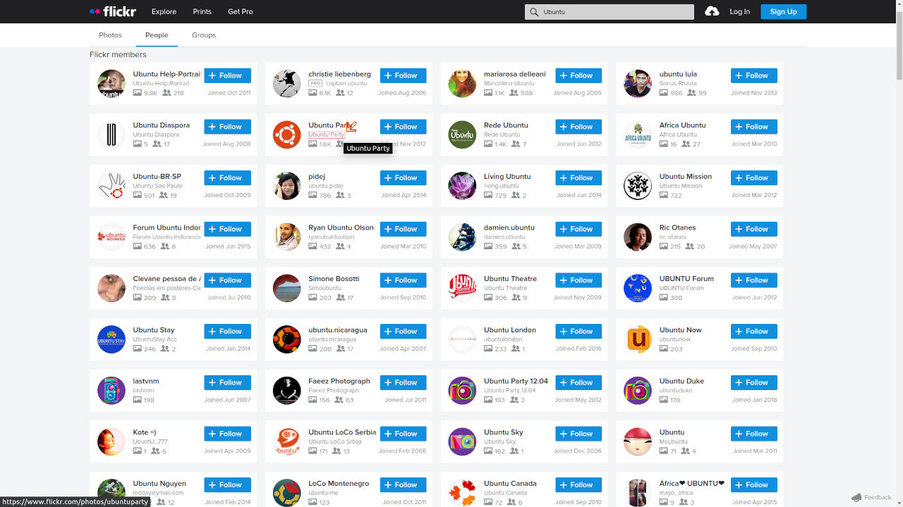

# 📸 Flickr Photos - Public Gallery Viewer

A simple photo gallery that displays public photos from any Flickr user using the Flickr API.  
Built with **Vue 3 + Vite** for the frontend and **Express** middleware to safely handle API access.

You can search for any Flickr user by their username.  
Example output:



---

## 📦 Stack Overview

- ⚡ [Vite](https://vitejs.dev/) + Vue 3 (frontend)
- 🌐 Express.js as middleware (backend API proxy)
- 🐳 Docker + Docker Compose (for development and deployment)
- 🎨 Bootstrap + Less CSS
- 🔒 Environment-based API key protection

---

## 📁 Project Structure

```
.
├── app/
│   ├── src/                 # Vue 3 app
│   ├── public/              # Static assets
│   ├── middleware/          # Express server for Flickr proxy
│   ├── .env.example         # API key reference
│   ├── package.json         # Dependencies & scripts
│   ├── vite.config.js       # Vite settings & dev proxy
│   └── yarn.lock
├── Dockerfile
└── docker-compose.yaml
```

---

## 🚀 Getting Started

Make sure you have the following installed:

- [Docker](https://www.docker.com/get-started)
- [Docker Compose](https://docs.docker.com/compose/install/)

Then run the app:

```bash
docker compose up --build
```

Frontend will be served at [http://localhost:2469](http://localhost:2469)  
Backend API will be available at [http://localhost:3000/api/flickr](http://localhost:3000/api/flickr?method=...)

---

## ⚙️ Build for Production

Run these commands inside the container:

```bash
docker exec -it flickr-gallery_ctn sh
yarn build
```

The built files will be in `app/dist`.

---

## 🧪 Development Features

- Hot Module Reload (HMR) for Vue via Vite
- Auto proxy from frontend to Express (`/api` → `localhost:3000`)
- Secure backend API key usage via `.env` file
- Pre-configured script commands:

```bash
yarn dev           # Start both Vite and Express servers
yarn dev:vite      # Start only the Vite server
yarn dev:api       # Start only the Express middleware
yarn build         # Build frontend for production
yarn preview       # Serve built frontend locally
```

---

## 🌐 Environment Variables

Create a file `app/.env` based on `app/.env.example`:

```
VITE_API_KEY=your_flickr_api_key_here
```

---

## 🧠 Notes

- Uses the Flickr API: [Flickr API Docs](https://www.flickr.com/services/api/)
- Includes image search by `flickr.people.findByUsername`
- Express handles API requests to prevent exposing the API key

---

## 📄 License

Personal/public project. Reuse freely.