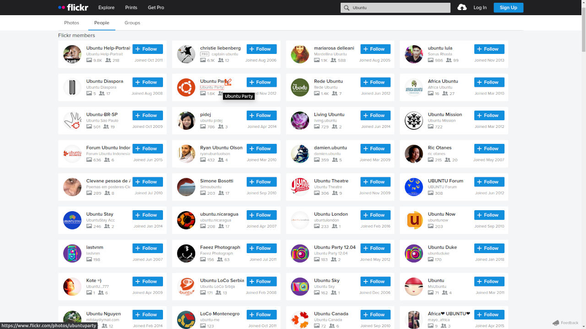

# 📸 Flickr Photos - Public Gallery Viewer

[](https://github.com/MarcMunhoz/flickr_photos)
[](https://vuejs.org/)
[](https://vite.dev/)
[](https://nodejs.org/)
[](https://www.netlify.com/)

A Vue 3 application for exploring public Flickr photography. Search for a Flickr
username to browse their public gallery, or discover recent public uploads with
filters for dates, titles, publishers, tags, and safe content.



---

## ✨ Features

- Public galleries resolved from Flickr usernames
- Recent public photo stream with incremental loading
- Date range, title, publisher, tag, and safe-content filters
- Photo details and links to the original Flickr pages
- Responsive interface with custom Flickr-inspired styling
- Express API proxy that keeps the Flickr API key on the server

---

## 🏗️ Architecture

The Vue frontend communicates with an Express middleware instead of accessing
the Flickr API directly. The middleware validates supported Flickr methods,
injects the private API key, and returns the upstream response.

Production uses separate deployments:

- The frontend is built by Netlify with `yarn build`
- The API proxy is hosted separately and can be configured with
  `VITE_API_BASE_URL`
- Docker Compose remains available for local development

---

## 📦 Technology

- 🟢 [Vue 3](https://vuejs.org/) and [Vue Router](https://router.vuejs.org/)
- ⚡ [Vite](https://vite.dev/)
- 📅 [Vue Datepicker](https://vue3datepicker.com/)
- 🎨 [Bootstrap](https://getbootstrap.com/) and Less
- 🌐 [Express](https://expressjs.com/)
- 🐳 Docker and Docker Compose

---

## 📁 Project Structure

```text
.
├── app/
│   ├── middleware/          # Express proxy for the Flickr API
│   ├── public/              # Static assets
│   ├── src/
│   │   ├── api/             # Frontend API client
│   │   ├── components/      # Reusable Vue components
│   │   ├── composables/     # Shared reactive behavior
│   │   ├── utils/           # Date and photo helpers
│   │   └── views/           # Route-level views
│   ├── netlify.toml         # Netlify redirects and security headers
│   ├── package.json
│   └── vite.config.js
├── Dockerfile
└── docker-compose.yaml
```

---

## 🚀 Local Development

Docker and Docker Compose are required for the containerized environment:

```bash
docker compose up --build
```

The frontend is served at [http://localhost:2469](http://localhost:2469), and
the API proxy is available at
[http://localhost:3000/api/flickr](http://localhost:3000/api/flickr).

The application can also run directly from the `app` directory after its
dependencies are installed:

```bash
yarn dev
```

Available commands:

```text
yarn dev         Start Vite and the Express middleware
yarn dev:vite    Start only the Vite development server
yarn dev:api     Start only the Express middleware
yarn build       Create the production frontend bundle
yarn preview     Preview the production frontend bundle
yarn start       Start only the Express middleware
```

---

## ⚙️ Configuration

The API proxy requires a Flickr API key:

```text
API_KEY=your_flickr_api_key
```

Optional configuration:

```text
ALLOWED_ORIGINS=https://your-frontend.example
VITE_API_BASE_URL=https://your-api.example/api
```

`ALLOWED_ORIGINS` configures the middleware CORS allowlist.
`VITE_API_BASE_URL` overrides the frontend API endpoint at build time.

---

## 🌐 Production

Netlify builds the frontend from the `app` directory and publishes the generated
`dist` directory. The SPA redirect and response security headers are defined in
`app/netlify.toml`.

The Express middleware must be deployed separately with `API_KEY` and the
production `ALLOWED_ORIGINS` value configured by the hosting provider.

---

## 🧠 Flickr API

The application uses the official
[Flickr API](https://www.flickr.com/services/api/) for username lookup, public
photo galleries, recent uploads, and photo metadata.

---

## 📄 License

Personal/public project. Reuse freely.
